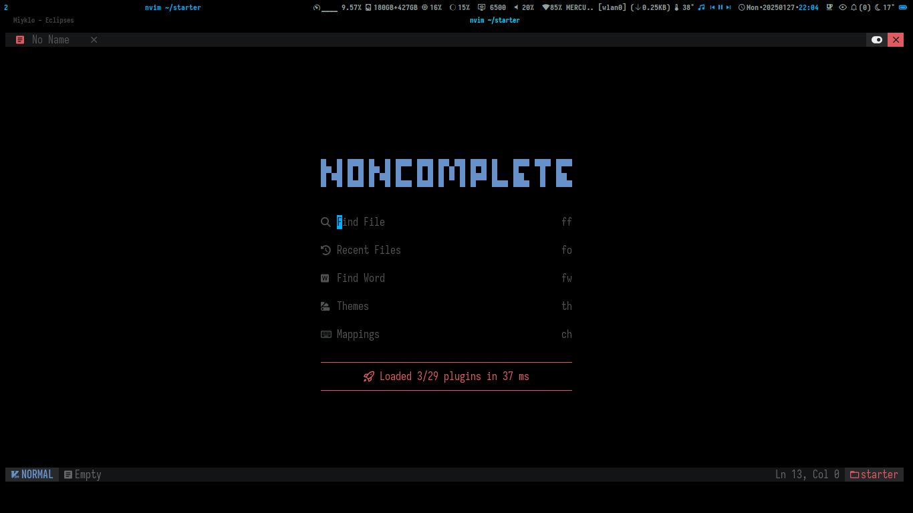
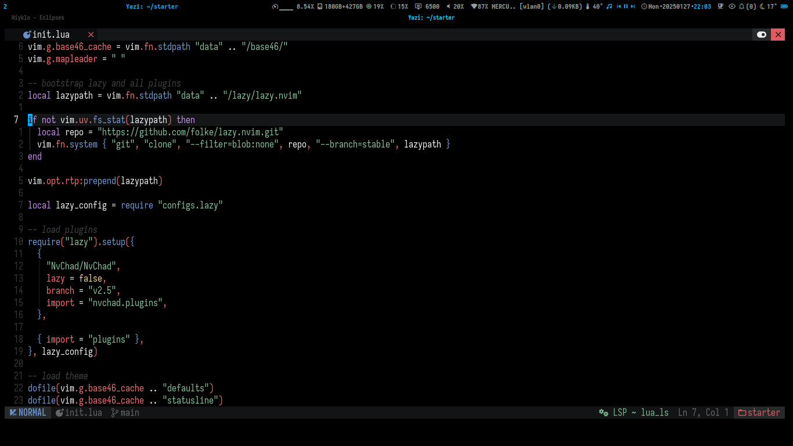

 █▄ █ █▀█ █▄ █ █▀▀ █▀█ █▀▄▀█ █▀█ █   █▀▀ ▀█▀ █▀▀ ▀ █▀▀
 █ ▀█ █▄█ █ ▀█ █▄▄ █▄█ █ ▀ █ █▀▀ █▄▄ ██▄  █  ██▄   ▄▄█

 █▄ █ █▀▀ █▀█ █ █ █ █▀▄▀█
 █ ▀█ ██▄ █▄█ ▀▄▀ █ █ ▀ █

 

- Some changes to the completion behaviour
- Darkens some base colors
- Init plugins for latex, zen-mode, twilight

TODO:
- [ ] Add some plugins for Julia and Ipyhton
